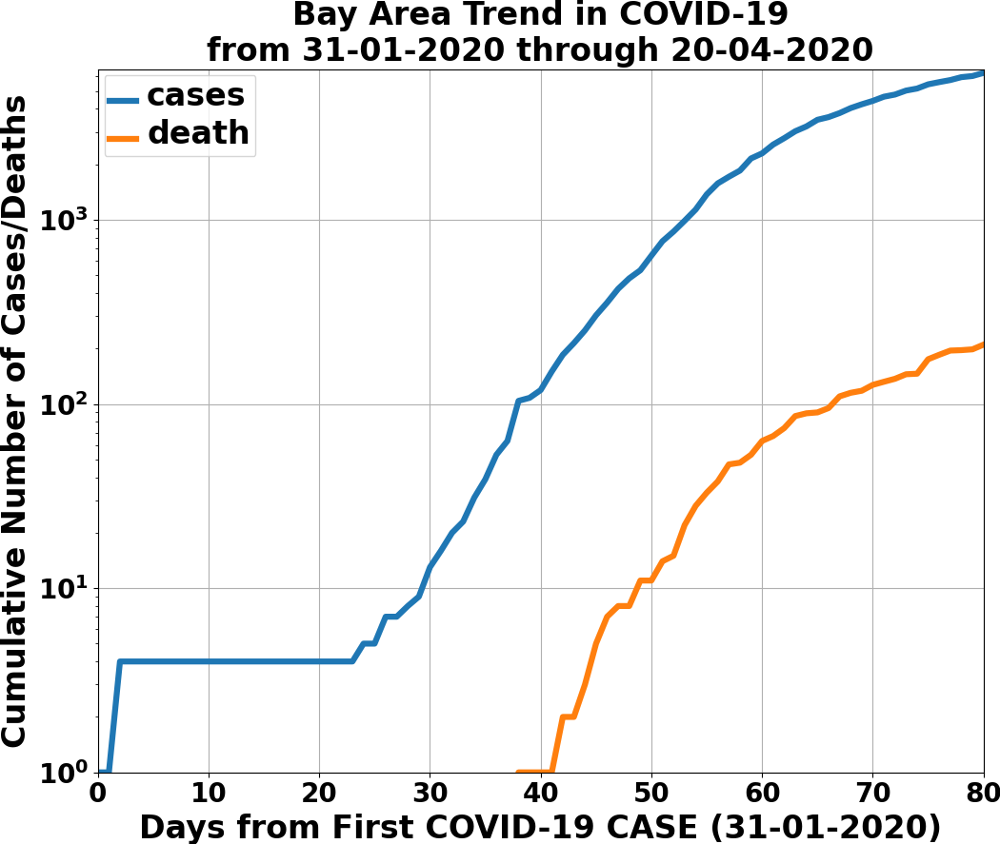
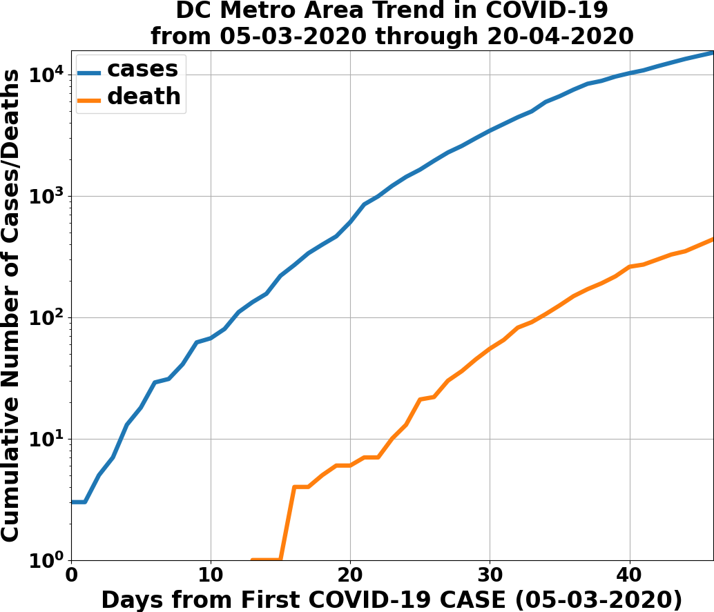
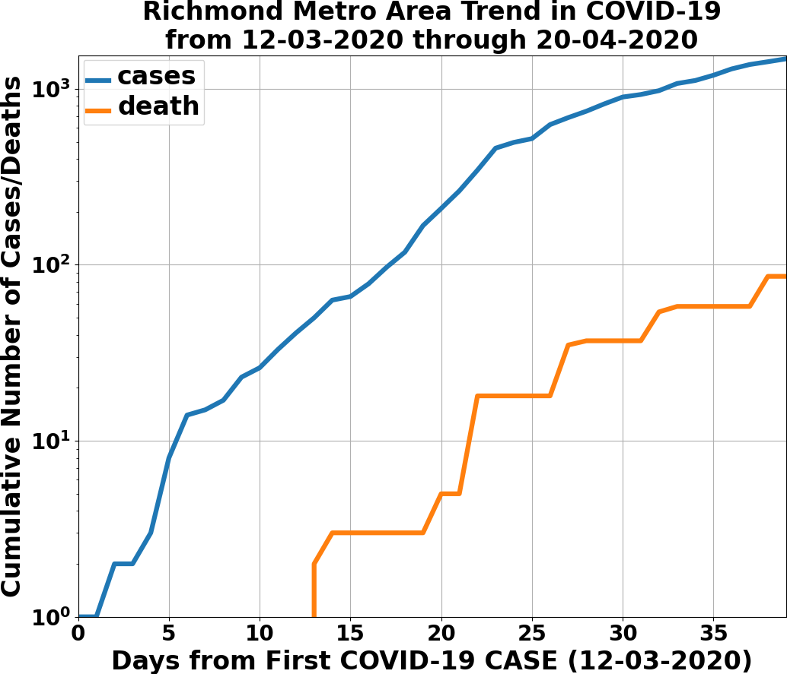
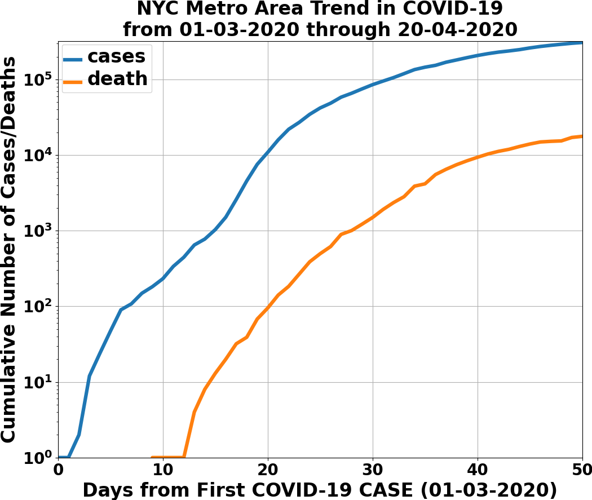
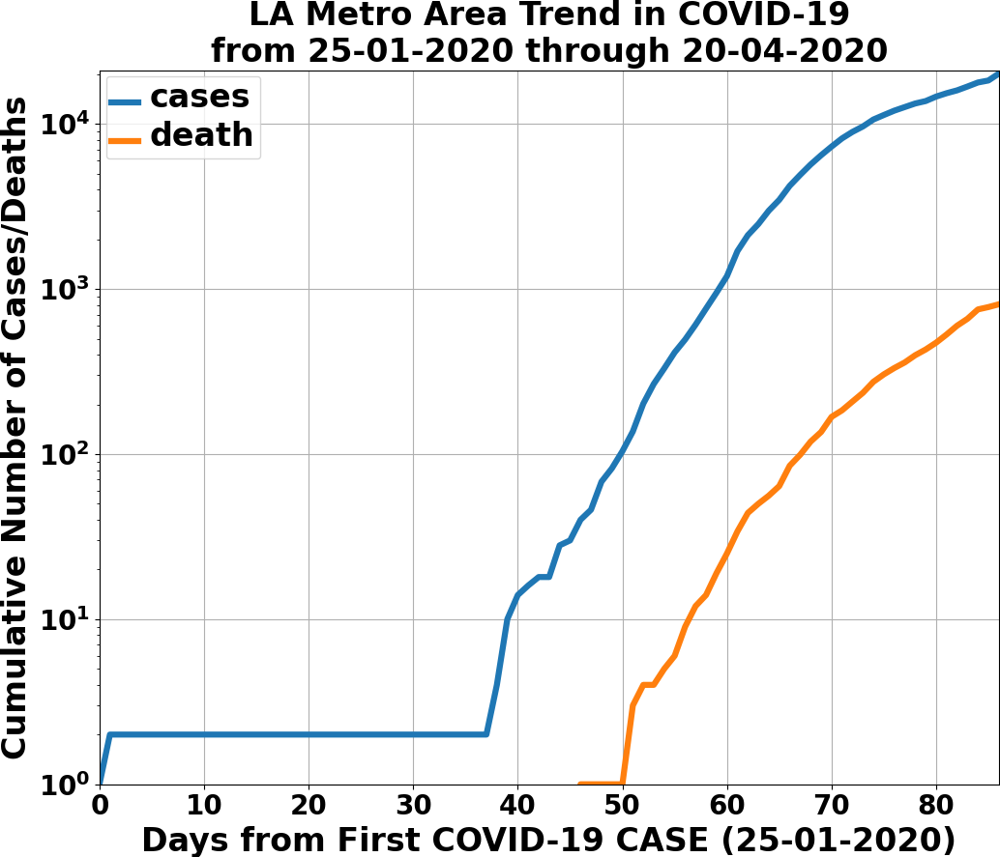
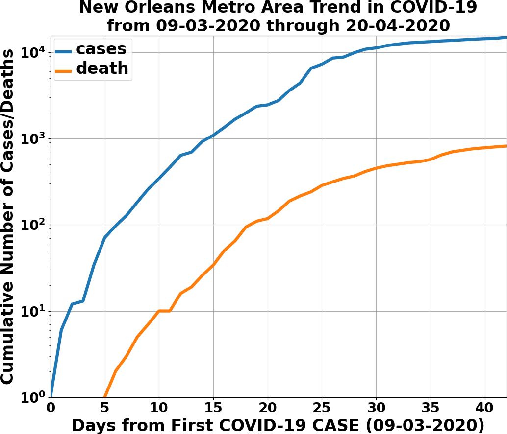

# README

Hello world! This is my COVID-19 tracker. There is a git submodule, the [NY Times COVID-19 repository](https://github.com/nytimes/covid-19-data), that needs to be updated frequently to get the latest data. The easiest way to update is to run this command in the checked out repo,
```bash
git -C covid-19-data pull origin master
```
This is not nearly as sophisticated as what's in [ncov2019.live](https://ncov2019.live), and described in [this New Yorker article](https://www.newyorker.com/magazine/2020/03/30/the-high-schooler-who-became-a-covid-19-watchdog).

I have made major changes in the functionality and implementation from the original commits, since commit [#78917](https://github.com/tanimislam/covid19_stats/commit/78917dd20c43bd65320cf51958fa481febef4338) for instance.

* The API code has been refactored into the ``engine`` subdirectory, and is divided into three main submodules: ``engine.core`` provides the higher level API calls for processing the COVID-19 data; ``engine.gis`` provides the lower-level APIs to write out, read in, and process the raw GIS data provided mainly by the US Census Bureau; and ``engine.viz`` does the visualization part.

* There is a single command line tool, ``covid19_create_movie_or_summary.py``, that can do the following: summarizes US metropolitan statistical areas (MSA) and gives their latest COVID-19 statistics; makes movie animations of the COVID-19 cases and deaths, from first case to latest incident date, for a given MSA; and prints out summary plots, and incident data, of COVID-19 cases and deaths for the latest incident day.

* The ``testing`` subdirectory contains [Jupyter Notebooks](https://jupyter.org) that illuminate bits and pieces of this COVID-19 tracker's functionality.

Here is some output from using this COVID-19 tracker.

* The summary of COVID-19 statistics for the top 20 MSAs by estimated 2019 population.

  RANK  IDENTIFIER        NAME                                    POPULATION    FIRST INC.          NUM DAYS    NUM CASES    NUM DEATHS
------  ----------------  --------------------------------------  ------------  ----------------  ----------  -----------  ------------
     1  nyc               NYC Metro Area                          19,216,182    01 March 2020             50       308986         17731
     2  losangeles        LA Metro Area                           18,711,436    25 January 2020           86        20173           808
     3  chicago           Chicago Metro Area                      9,458,539     24 January 2020           87        30653          1301
     4  dallas            Dallas Metro Area                       7,573,136     09 March 2020             42         5200           138
     5  houston           Houston Metro Area                      7,066,141     04 March 2020             47         7073           125
     6  bayarea           Bay Area                                6,860,207     31 January 2020           80         6272           210
     7  dc                DC Metro Area                           6,280,487     05 March 2020             46        15075           438
     8  miami             Miami Metro Area                        6,166,488     06 March 2020             45        15992           467
     9  philadelphia      Philadelphia Metro Area                 6,102,434     06 March 2020             45        24201          1004
    10  atlanta           Atlanta Metro Area                      6,020,364     02 March 2020             49         9688           342
    11  phoenix           Phoenix Metro Area                      4,948,203     26 January 2020           85         2892            82
    12  boston            Boston Metro Area                       4,873,019     01 February 2020          79        30399          1298
    13  detroit           Detroit Metro Area                      4,319,629     10 March 2020             41        25200          2072
    14  seattle           Seattle Metro Area                      3,979,845     21 January 2020           90         8651           492
    15  minneapolis       Minneapolis Metro Area                  3,640,043     06 March 2020             45         1626           106
    16  sandiego          San Diego Metro Area                    3,338,330     10 February 2020          70         2325            72
    17  tampa             Tampa Metro Area                        3,194,831     01 March 2020             50         1873            41
    18  denver            Denver Metro Area                       2,967,239     05 March 2020             46         5963           248
    19  stlouis           St. Louis Metro Area                    2,803,228     07 March 2020             44         4559           178
    20  baltimore         Baltimore Metro Area                    2,800,053     08 March 2020             43         5609           185
	
* The COVID-19 trends in cases and deaths for these 6 metropolitan areas through 20 APRIL 2020: SF Bay Area; Washington, DC; Richmond, VA; NYC; Los Angeles; and New Orleans.

| | | |
|:---------------------------------------------------------------:|:------------------------------------------------------------------:|:------------------------------------------------------------------:|
|  |          |    |
| SF Bay Area                                                     | Washington, DC                                                     | Richmond, VA                                                       |
|      |  |  |
| NYC Metro                                                       | Los Angeles                                                        | New Orleans                                                        |
