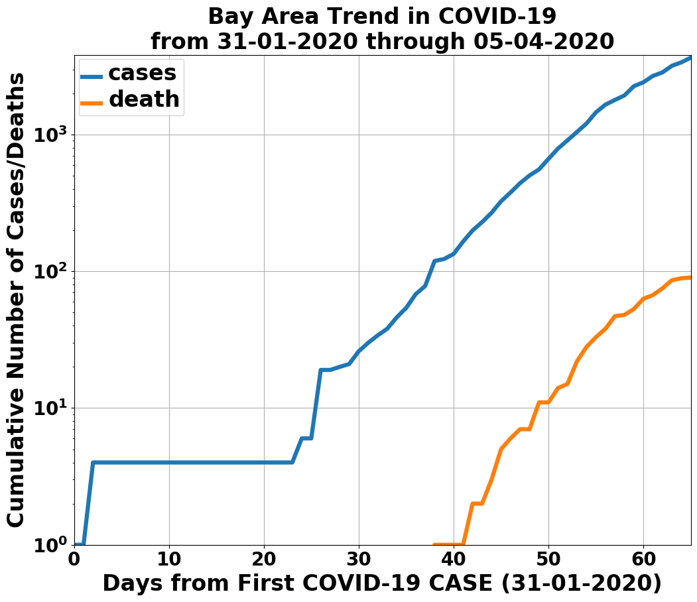
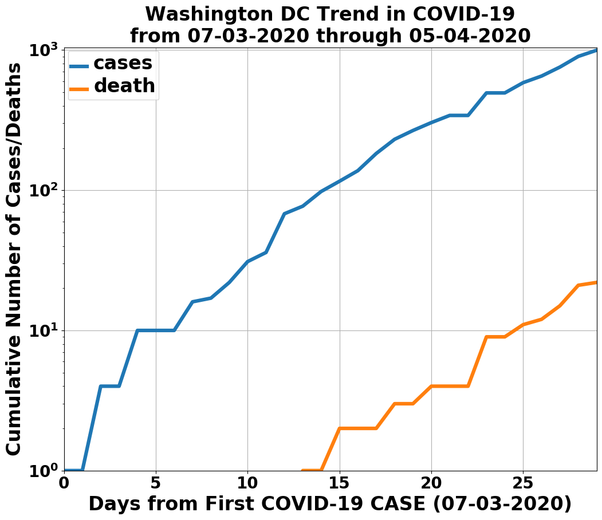
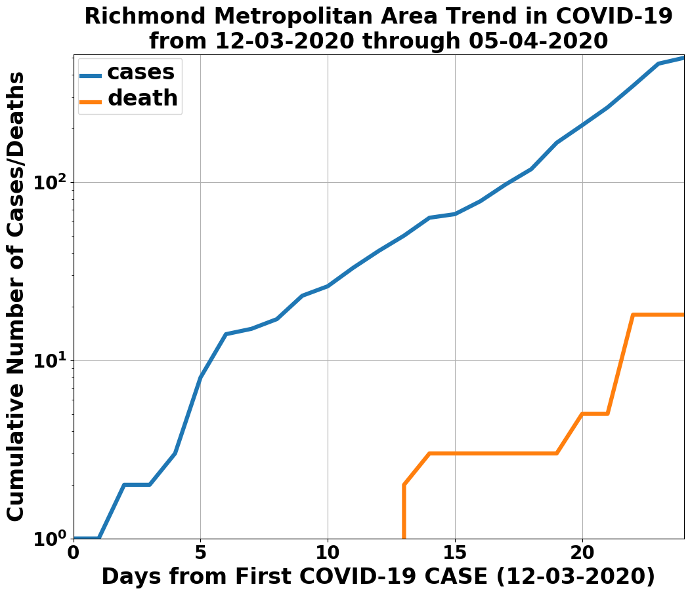

# README

Hello world! This is my COVID-19 tracker. There is a git submodule, the [NY Times COVID-19 repository](https://github.com/nytimes/covid-19-data), that needs to be updated frequently to get the latest data. The easiest way to update is to run this command in the checked out repo,
```bash
git -C covid-19-data pull
```
This is not nearly as sophisticated as what's in [ncov2019.live](https://ncov2019.live), and described in [this New Yorker article](https://www.newyorker.com/magazine/2020/03/30/the-high-schooler-who-became-a-covid-19-watchdog).

The code that processes the COVID-19 recorded cases and deaths, dumps out the data into the Pandas serialized data format, and makes plots, is in ``engine.py``. Running ``demo.py`` this way, ``python3 demo.py``, produces the latest summary data for the Bay Area, the Richmond metro area, and DC (here, as of 6 APRIL 2020).

| | | |
|:-------------------------:|:-------------------------:|:-------------------------:|
| |  |  |
| SF Bay Area | DC | Richmond metro |
