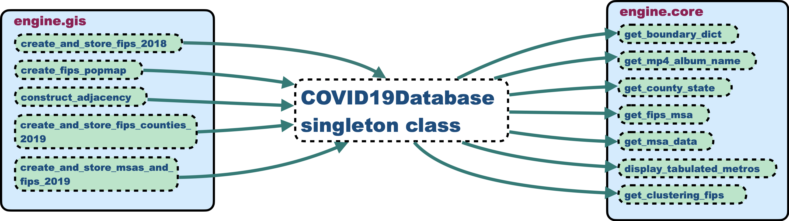

.. include:: api_urls.rst

.. _using_the_api:

THE COVID19_STATS API
========================
The API provides a much richer base of functionality than the :ref:`CLI tools <using_the_cli>`, although I have gotten *very* far by using them. The structure of the API consists of a singleton_ that contains all the GIS_, full COVID-19 state of all counties in the US, and necessary configuration data. :numref:`figure_of_api_flow` describes the implementation flow of synthesizing COVID-19 summary data.

.. _figure_of_api_flow:

   :py:class:`COVID19Database <covid19_stats.COVID19Database>` is the singleton_ that contains US GIS_ data, and trends of cumulative COVID-19 cases and deaths for *all* counties and atomic territorial units within the United States. It is somewhat-lazily instantiated by GIS_ functionality that lives in :py:mod:`gis <covid19_stats.engine.gis>`, and is in turn called by utility methods in :py:mod:`core <covid19_stats.engine.core>`.

Subsequent subsections describe each of the main modules, with special emphasis given to :py:class:`COVID19Database <covid19_stats.COVID19Database>` due to its integral role.

covid19_stats module
----------------------
This is the top-level module for this repository. It defines the location of the resource directory relative to the module's installation location (see :numref:`resources_directory`), and the main COVID-19 database singleton_ object.

.. automodule:: covid19_stats
   :members:

covid19_stats.engine module
------------------------------
This contains all the back-end functionality used by the CLI programs (see :numref:`using_the_cli`), and two fairly simple utility functions.

.. automodule:: covid19_stats.engine
   :members:

covid19_stats.engine.gis module
-----------------------------------------
The meat of the functionality, that generates post-processed GIS_ data describing the territorial units (counties, etc.) of the United States. Territorial unit information includes their identifiers, latitude and longitude boundary arrays as of 2018, and their estimated population in 2019.

.. automodule:: covid19_stats.gis
   :members:
