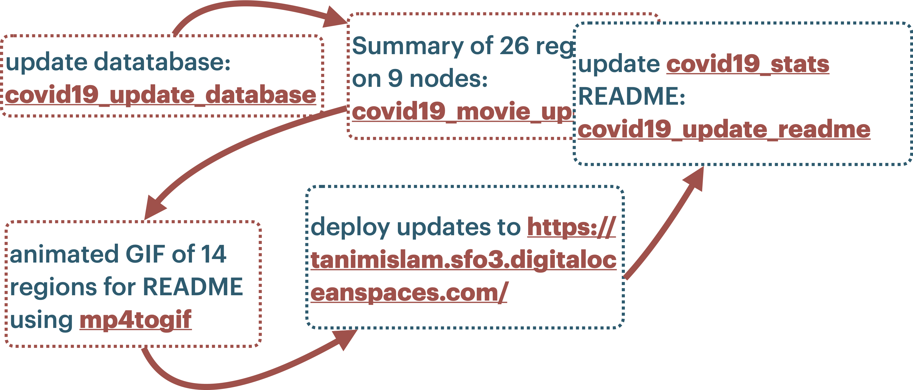

.. include:: cli_urls.rst

.. _using_the_cli:

USING THE CLI
==================
There are *seven* command line interfaces that have been defined here.

The first CLI, :ref:`covid19_update_database`, *only* updates the  `NY Times COVID-19 repository`_ with the latest data.

The next two CLIs, :ref:`covid19_create_movie_or_summary` and :ref:`covid19_state_summary`, synthesize the COVID-19 movies and figures, that represent *cumulative* cases and deaths, for metropolitan statistical areas (MSAs), the CONUS_, or individual US states and territories. The third CLI, :ref:`covid19_region_summary_rate`, synthesizes the COVID-19 movies and figures, that represent *seven day averaged* new cases and deaths per day, for MSAs, the CONUS_, or individdual US states and territories.

The final three CLIs, :ref:`covid19_movie_updates`, :ref:`covid19_post2server`, and :ref:`covid19_update_readme`, are designed for external services to *deploy* summary data on specific US regions into other locations. A currently private (but perhaps soon to be *public*) GitHub repo, `covid19movies <https://github.com/tanimislam/covid19movies>`_, does the following five things in order.

1. Updates the NY Times COVID-19 data locally by running :ref:`covid19_update_database`.

2. Creates summary movies of 26 regions (described :ref:`here <covid19_movie_updates_illuminating>`) using :ref:`covid19_movie_updates`, using nine nodes on a supercomputing cluster.

3. Creates animated GIFs of 14 regions, described in the `README <https://tanimislam.github.io/covid19_stats>`_, using back-end functionality implemented by :py:meth:`mp4togif <nprstuff.core.convert_image.mp4togif>`.

4. *Deploys* the summary COVID-19 cumulative cases and deaths, movies and figures and JSON_ files, into `https://tanimislam.github.io/covid19movies <https://tanimislam.github.io/covid19movies>`_.

5. Updates the `covid19_stats repo <https://github.com/tanimislam/covid19_stats>`_ ``README`` using :ref:`covid19_update_readme`.

This tooling updates the COVID-19 summary data, and the `covid19_stats repo <https://github.com/tanimislam/covid19_stats>`_ ``README``, every day at 1230 AM PST. Here is a diagram!

   Diagram taken from a presentation given at the 4 March 2021 Sacramento Python meetup, depicting the *five* steps needed to update COVID-19 summary data for 26 regions in the United States. As of 4 March 2021, the data takes up nearly 1 GB of space and takes roughly 45 minutes to generate.
   
Here are the seven command line tools.

.. toctree::
   :maxdepth: 3

   covid19_update_database
   covid19_create_movie_or_summary
   covid19_state_summary
   covid19_region_summary_rate
   covid19_movie_updates
   covid19_post2server
   covid19_update_readme
